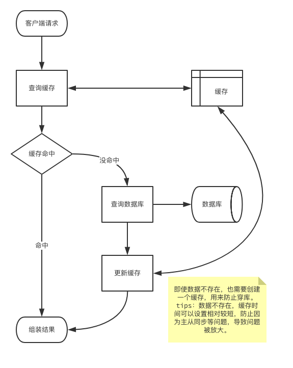
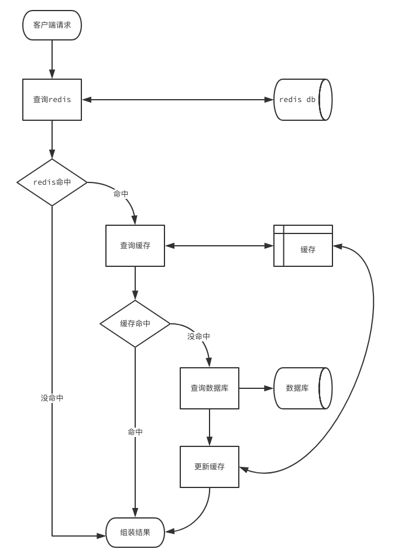
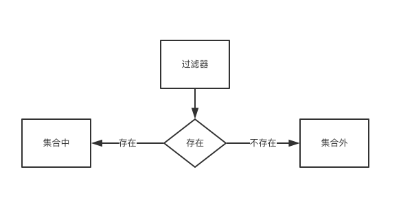
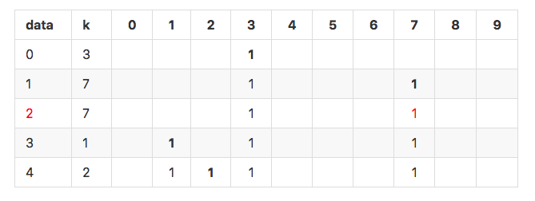
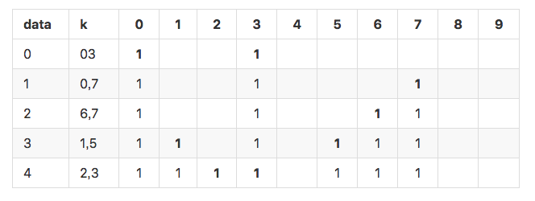
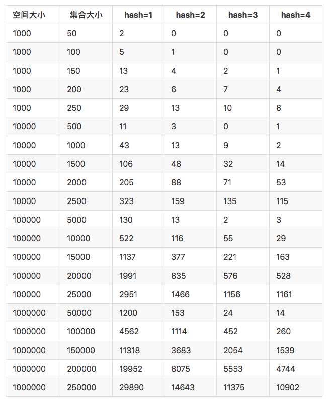

bloomfilter过滤器实战
===

为什么引入
---
我们的业务中经常会遇到穿库的问题，通常可以通过缓存解决。
如果数据维度比较多，结果数据集合比较大时，缓存的效果就不明显了。
因此为了解决穿库的问题，我们引入Bloom Filter。

我们先看看`一般业务缓存流程`：


先查询缓存，缓存不命中再查询数据库。
然后将查询结果放在缓存中即使数据不存在，也需要创建一个缓存，用来防止穿库。这里需要区分一下数据是否存在。
如果数据不存在，缓存时间可以设置相对较短，防止因为主从同步等问题，导致问题被放大。

这个流程中存在薄弱的问题是，当用户量太大时，我们会缓存大量数据空数据，并且一旦来一波冷用户，会造成雪崩效应。
对于这种情况，我们产生第二个版本流程:`redis过滤冷用户缓存流程`


我们将数据库里面中命中的用户放在redis的set类型中，设置不过期。
这样相当把redis当作数据库的索引，只要查询redis，就可以知道是否数据存在。
redis中不存在就可以直接返回结果。
如果存在就按照上面提到`一般业务缓存流程`处理。

聪明的你肯定会想到更多的问题：

1. redis本身可以做缓存，为什么不直接返回数据呢？
2. 如果数据量比较大，单个set，会有性能问题？
3. 业务不重要，将全量数据放在redis中，占用服务器大量内存。投入产出不成比例？

问题1需要区分业务场景，结果数据少，我们是可以直接使用redis作为缓存，直接返回数据。
结果比较大就不太适合用redis存放了。比如ugc内容，一个评论里面可能存在上万字，业务字段多。

redis使用有很多技巧。bigkey 危害比较大，无论是扩容或缩容带来的内存申请释放，
还是查询命令使用不当导致大量数据返回，都会影响redis的稳定。这里就不细谈原因及危害了。
解决bigkey 方法很简单。我们可以使用hash函数来分桶，将数据分散到多个key中。
减少单个key的大小，同时不影响查询效率。

问题3是redis存储占用内存太大。因此我们需要减少内存使用。
重新思考一下引入redis的目的。
redis像一个集合，整个业务就是验证请求的参数是否在集合中。

这个结构就像洗澡的时候用的双向阀门：左边热水，右边冷水。

大部分的编程语言都内置了filter。
拿`python`举例，filter函数用于过滤序列，
过滤掉不符合条件的元素，返回由符合条件元素组成的列表。

我们看个例子：

    $ python2
    Python 2.7.10 (default, Oct  6 2017, 22:29:07)
    [GCC 4.2.1 Compatible Apple LLVM 9.0.0 (clang-900.0.31)] on darwin
    Type "help", "copyright", "credits" or "license" for more information.
    >>> s = {2, 4}
    >>> filter(lambda x:x in s, [0, 1, 2])
    [2]

集合s中存在 2，4两个数字，我们需要查询 0，1，2 那些在集合s中。
`lambda x:x in s`构造一个匿名函数，判断入参x是否在集合s中。
过滤器filter依次对列表中的数字执行匿名函数。最终返回列表`[2]`。

redis中实现set用了两种结构：intset和hash table。
非数字或者大量数字时都会退化成hash table。
那么是否好的算法可以节省hash table的大小呢？

其实早在1970年由`Burton Howard Bloom`提出的布隆过滤器（英语：Bloom Filter）。
它实际上是一个很长的二进制向量和一系列随机映射函数。
布隆过滤器可以用于检索一个元素是否在一个集合中。
它的优点是空间效率和查询时间都远远超过一般的算法，
缺点是有一定的误识别率和删除困难。

BloomFilter原理
---
我们常见的将业务字段拼接之后md5，放在一个集合中。
md5生成一个固定长度的128bit的串。
如果我们用bitmap来表示，则需要
```
2**128 = 340282366920938463463374607431768211456 bit
```
判断一个值在不在，就变成在这个bitmap中判断所在位是否为1。
但是我们全世界的机器存储空间也无法存储下载。
因此我们只能分配有限的空间来存储。
比如:
```python
import crc32

def BloomFilter(sample, size, hash_size=1):
    # 构造一个hash函数，将输入数据散列到size一个位置上
    hash = lambda x:crc32(str(x).encode())%size
    collision, s = 0, set()
    for i in range(sample):
        k = set()
        for j in range(hash_size):
            k.add(hash(i+j*size/hash_size))
        # 只有所有散列结果k都在s中，才认为i重复
        if not k - s:
            collision += 1
            continue
        # 将散列结果k更新到集合s中
        s |= k
    return collision
```
当只有一个hash函数时：很容易发生冲突。

<!--
data | k | 0 | 1 | 2 | 3 | 4 | 5 | 6 | 7 | 8 | 9
:---|:---|:---:|:---:|:---:|:---:|:---:|:---:|:---:|:---:|:---:|:---:
0|3||||<span style="font-weight:bold;">1</span>|||||||||
1|7||||1||||<span style="font-weight:bold;">1</span>||
<span style="color:red">2</span>|7||||1||||<span style="color:red">1</span>||
3|1||<span style="font-weight:bold">1</span>||1||||1||
4|2||1|<span style="font-weight:bold">1</span>|1||||1||
-->
可以看到上面1和2的hash结果都是7，发生冲突。
如果增加hash函数，会发生什么情况？


<!--
data | k | 0 | 1 | 2 | 3 | 4 | 5 | 6 | 7 | 8 | 9
:---|:---|:---:|:---:|:---:|:---:|:---:|:---:|:---:|:---:|:---:|:---:
0|03|<span style="font-weight:bold;">1</span>|||<span style="font-weight:bold">1</span>||||||
1|0,7|1|||1||||<span style="font-weight:bold;">1</span>||
2|6,7|1|||1|||<span style="font-weight:bold;">1</span>|1||
3|1,5|1|<span style="font-weight:bold">1</span>||1||<span style="font-weight:bold">1</span>|1|1||
4|2,3|1|1|<span style="font-weight:bold">1</span>|<span style="font-weight:bold">1</span>||1|1|1||
-->

我们使用更多的hash函数和更大的数据集合来测试。得到下面这张表

<!--
空间大小 | 集合大小 | hash=1 | hash=2 | hash=3 | hash=4
 :--- |  ---  | --- | --- | --- | --- |
1000|50|2|0|0|0
1000|100|5|1|0|0
1000|150|13|4|2|1
1000|200|23|6|7|4
1000|250|29|13|10|8
10000|500|11|3|0|1
10000|1000|43|13|9|2
10000|1500|106|48|32|14
10000|2000|205|88|71|53
10000|2500|323|159|135|115
100000|5000|130|13|2|3
100000|10000|522|116|55|29
100000|15000|1137|377|221|163
100000|20000|1991|835|576|528
100000|25000|2951|1466|1156|1161
1000000|50000|1200|153|24|14
1000000|100000|4562|1114|452|260
1000000|150000|11318|3683|2054|1539
1000000|200000|19952|8075|5553|4744
1000000|250000|29890|14643|11375|10902
-->

由此可以看到当增加hash方法能够有效的降低碰撞机率。
比较好的数据如下：

<!--
空间大小 | 集合大小 | hash=1 | hash=2 | hash=3 | hash=4
 :--- |  ---  | --- | --- | --- | --- |
1000|100|5|1|0|0
10000|1000|43|13|9|2
100000|10000|522|116|55|29
1000000|100000|4562|1114|452|260
-->

但是增加了hash方法之后，会降低空间的使用效率。当集合占用总体空间达到25%的时候，
增加hash 的效果已经不明显


<!--
空间大小 | 集合大小 | hash=1 | hash=2 | hash=3 | hash=4
 :--- |  ---  | --- | --- | --- | --- |
1000|250|29|13|10|8
10000|2500|323|159|135|115
100000|25000|2951|1466|1156|1161
1000000|250000|29890|14643|11375|10902
-->

上面的使用多个hash方法来降低碰撞就是BloomFilter的核心思想。


适合的场景
---
- 数据库防止穿库
Google Bigtable，Apache HBase和Apache Cassandra以及Postgresql 使用BloomFilter来减少不存在的行或列的磁盘查找。避免代价高昂的磁盘查找会大大提高数据库查询操作的性能。
如同一开始的业务场景。如果数据量较大，不方便放在缓存中。需要对请求做拦截防止穿库。

- 缓存宕机
缓存宕机的场景，使用布隆过滤器会造成一定程度的误判。原因是除了Bloom Filter 本身有误判率，宕机之前的缓存不一定能覆盖到所有DB中的数据，当宕机后用户请求了一个以前从未请求的数据，这个时候就会产生误判。当然，缓存宕机时使用布隆过滤器作为应急的方式，这种情况应该也是可以忍受的。

- WEB拦截器
相同请求拦截防止被攻击。用户第一次请求，将请求参数放入BloomFilter中，当第二次请求时，先判断请求参数是否被BloomFilter命中。可以提高缓存命中率

- 恶意地址检测
chrome 浏览器检查是否是恶意地址。
首先针对本地BloomFilter检查任何URL，并且仅当BloomFilter返回肯定结果时才对所执行的URL进行全面检查（并且用户警告，如果它也返回肯定结果）。

- 比特币加速
bitcoin 使用BloomFilter来加速钱包同步。

算法优点：
---
- 数据空间小，不用存储数据本身。

算法本身缺点：
---
 - 元素可以添加到集合中，但不能被删除。
 - 匹配结果只能是“绝对不在集合中”，并不能保证匹配成功的值已经在集合中。
 - 当集合快满时，即接近预估最大容量时，误报的概率会变大。
 - 数据占用空间放大。一般来说，对于1％的误报概率，每个元素少于10比特，与集合中的元素的大小或数量无关。
 - 查询过程变慢，hash函数增多，导致每次匹配过程，需要查找多个位（hash个数）来确认是否存在。

对于BloomFilter的优点来说，缺点都可以忽略。毕竟只需要kN的存储空间就能存储N个元素。空间效率十分优秀。

如何使用BloomFilter
---
BloomFilter 需要一个大的bitmap来存储。鉴于目前公司现状，最好的存储容器是redis。
从[github topics: bloom-filter](https://github.com/topics/bloom-filter)中经过简单的调研。

redis集成BloomFilter方案：
- 原生python 调用setbit 构造 BloomFilter
- [lua脚本](https://github.com/erikdubbelboer/redis-lua-scaling-bloom-filter)
- [Rebloom - Bloom Filter Module for Redis](https://github.com/RedisLabsModules/rebloom) (注：redis Module在redis4.0引入)
- 使用hiredis 调用redis [pyreBloom](https://github.com/seomoz/pyreBloom)

原生python 方法太慢，lua脚本和module 部署比较麻烦。于是我们推荐使用pyreBloom，底层使用。
```shell
pyreBloom:master λ ls
Makefile      bloom.h       bloom.pxd     murmur.c      pyreBloom.pyx
bloom.c       bloom.o       main.c        pyreBloom.c
```
从文件命名上可以看到bloom 使用c编写。pyreBloom 使用cython编写。

bloom.h 里面实现BloomFilter的核心逻辑，完成与redis server的交互；hash函数；添加，检查和删除方法的实现。
```c
int init_pyrebloom(pyrebloomctxt * ctxt, char * key, uint32_t capacity, double error, char* host, uint32_t port, char* password, uint32_t db);
int free_pyrebloom(pyrebloomctxt * ctxt);

int add(pyrebloomctxt * ctxt, const char * data, uint32_t len);
int add_complete(pyrebloomctxt * ctxt, uint32_t count);

int check(pyrebloomctxt * ctxt, const char * data, uint32_t len);
int check_next(pyrebloomctxt * ctxt);

int delete(pyrebloomctxt * ctxt);
```
pyreBloom.pyx
```python
import math
import random

cimport bloom


class pyreBloomException(Exception):
	'''Some sort of exception has happened internally'''
	pass


cdef class pyreBloom(object):
	cdef bloom.pyrebloomctxt context
	cdef bytes               key

	property bits:
		def __get__(self):
			return self.context.bits

	property hashes:
		def __get__(self):
			return self.context.hashes

	def __cinit__(self, key, capacity, error, host='127.0.0.1', port=6379,
		password='', db=0):
		self.key = key
		if bloom.init_pyrebloom(&self.context, self.key, capacity,
			error, host, port, password, db):
			raise pyreBloomException(self.context.ctxt.errstr)

	def __dealloc__(self):
		bloom.free_pyrebloom(&self.context)

	def delete(self):
		bloom.delete(&self.context)

	def put(self, value):
		if getattr(value, '__iter__', False):
			r = [bloom.add(&self.context, v, len(v)) for v in value]
			r = bloom.add_complete(&self.context, len(value))
		else:
			bloom.add(&self.context, value, len(value))
			r = bloom.add_complete(&self.context, 1)
		if r < 0:
			raise pyreBloomException(self.context.ctxt.errstr)
		return r

	def add(self, value):
		return self.put(value)

	def extend(self, values):
		return self.put(values)

	def contains(self, value):
		# If the object is 'iterable'...
		if getattr(value, '__iter__', False):
			r = [bloom.check(&self.context, v, len(v)) for v in value]
			r = [bloom.check_next(&self.context) for i in range(len(value))]
			if (min(r) < 0):
				raise pyreBloomException(self.context.ctxt.errstr)
			return [v for v, included in zip(value, r) if included]
		else:
			bloom.check(&self.context, value, len(value))
			r = bloom.check_next(&self.context)
			if (r < 0):
				raise pyreBloomException(self.context.ctxt.errstr)
			return bool(r)

	def __contains__(self, value):
		return self.contains(value)

	def keys(self):
		'''Return a list of the keys used in this bloom filter'''
		return [self.context.keys[i] for i in range(self.context.num_keys)]
```

```c++
原生pyreBloom方法:

cdef class pyreBloom(object):

    cdef bloom.pyrebloomctxt context
    cdef bytes

    property bits:

    property hashes:
    // 使用的hash方法数

    def delete(self):
    // 删除，会在redis中删除

    def put(self, value):
    // 添加 底层方法, 不建议直接调用

    def add(self, value):
    // 添加单个元素，调用put方法

    def extend(self, values):
    // 添加一组元素，调用put方法

    def contains(self, value):
    // 检查是否存在，当`value`可以迭代时，返回`[value]`, 否则返回`bool`

    def keys(self):
    // 在redis中存储的key列表
```
由于pyreBloom使用hiredis库，本身没有重连等逻辑，于是错了简单的封装。
```python

    # coding=utf-8
    '''
    bloom filter 基础模块

    可用方法:
    extend, keys, contains, add, put, hashes, bits, delete

    使用方法:
    >>> class TestModel(BaseModel):
    ...    PREFIX = "bf:test"
    >>> t = TestModel()
    >>> t.add('hello')
    1
    >>> t.extend(['hi', 'world'])
    2
    >>> t.contains('hi')
    True
    >>> t.delete()
    '''
    import logging
    from six import PY3 as IS_PY3
    from pyreBloom import pyreBloom, pyreBloomException

    from BloomFilter.utils import force_utf8


    class BaseModel(object):
        '''
        bloom filter 基础模块
        参数：
            SLOT: 可用方法类型
            PREFIX: redis前缀
            BF_SIZE: 存储最大值
            BF_ERROR: 允许的出错率
            RETRIES: 连接重试次数
            host: redis 服务器IP
            port: redis 服务器端口
            db: redis 服务器DB
            _bf_conn: 内部保存`pyreBloom`实例
        '''
        SLOT = {'add', 'contains', 'extend', 'keys', 'put', 'delete',
                'bits', 'hashes'}
        PREFIX = ""
        BF_SIZE = 100000
        BF_ERROR = 0.01
        RETRIES = 2

        def __init__(self, redis=None):
            '''
            初始化redis配置
            :param redis: redis 配置
            '''
            # 这里初始化防止类静态变量多个继承类复用，导致数据被污染
            self._bf_conn = None

            self._conf = {
                'host': '127.0.0.1', 'password': '',
                'port': 6379, 'db': 0
            }

            if redis:
                for k, v in redis.items():
                    if k in self._conf:
                        self._conf[k] = redis[k]
            self._conf = force_utf8(self._conf)

        @property
        def bf_conn(self):
            '''
            初始化pyreBloom
            '''
            if not self._bf_conn:
                prefix = force_utf8(self.PREFIX)
                logging.debug(
                    'pyreBloom connect: redis://%s:%s/%s, (%s %s %s)',
                    self._conf['host'], self._conf['port'], self._conf['db'],
                    prefix, self.BF_SIZE, self.BF_ERROR,
                )
                self._bf_conn = pyreBloom(
                    prefix, self.BF_SIZE, self.BF_ERROR, **self._conf)
            return self._bf_conn

        def __getattr__(self, method):
            '''调用pyrebloom方法
            没有枚举的方法将从`pyreBloom`中获取
            :param method:
            :return: pyreBloom.{method}
            '''
            # 只提供内部方法
            if method not in self.SLOT:
                raise NotImplementedError()

            # 捕获`pyreBloom`的异常, 打印必要的日志
            def catch_error(*a, **kwargs):
                '''多次重试服务'''
                args = force_utf8(a)
                kwargs = force_utf8(kwargs)
                for _ in range(self.RETRIES):
                    try:
                        func = getattr(self.bf_conn, method)
                        res = func(*args, **kwargs)
                        # python3 返回值和python2返回值不相同，
                        # 手工处理返回类型
                        if method == 'contains' and IS_PY3:
                            if isinstance(res, list):
                                return [i.decode('utf8') for i in res]
                        return res
                    except pyreBloomException as error:
                        logging.warn(
                            'pyreBloom Error:  %s %s', method, str(error))
                        self.reconnect()
                        if _ == self.RETRIES:
                            logging.error('pyreBloom Error')
                            raise error

            return catch_error

        def __contains__(self, item):
            '''跳转__contains__方法
            :param item: 查询元素列表/单个元素
            :type item: list/basestring
            :return: [bool...]/bool
            '''
            return self.contains(item)

        def reconnect(self):
            '''
            重新连接bloom
            `pyreBloom` 连接使用c driver，没有提供timeout参数，使用了内置的timeout
            同时为了保证服务的可靠性，增加了多次重试机制。
            struct timeval timeout = { 1, 5000 };
            ctxt->ctxt = redisConnectWithTimeout(host, port, timeout);
            del self._bf_conn 会调用`pyreBloom`内置的C的del方法，会关闭redis连接
            '''
            if self._bf_conn:
                logging.debug('pyreBloom reconnect')
                del self._bf_conn
                self._bf_conn = None
                _ = self.bf_conn
```

进阶：计数过滤器(Counting Filter)
---
提供了一种在BloomFilter上实现删除操作的方法，而无需重新重新创建过滤器。在计数滤波器中，阵列位置（桶）从单个位扩展为n位计数器。实际上，常规布隆过滤器可以被视为计数过滤器，其桶大小为一位。

插入操作被扩展为递增桶的值，并且查找操作检查每个所需的桶是否为非零。然后，删除操作包括递减每个桶的值。

存储桶的算术溢出是一个问题，并且存储桶应该足够大以使这种情况很少见。如果确实发生，则增量和减量操作必须将存储区设置为最大可能值，以便保留BloomFilter的属性。

计数器的大小通常为3或4位。因此，计算布隆过滤器的空间比静态布隆过滤器多3到4倍。相比之下， Pagh，Pagh和Rao（2005）以及Fan等人的数据结构。（2014）也允许删除但使用比静态BloomFilter更少的空间。

计数过滤器的另一个问题是可扩展性有限。由于无法扩展计数布隆过滤器表，因此必须事先知道要同时存储在过滤器中的最大键数。一旦超过表的设计容量，随着插入更多密钥，误报率将迅速增长。

Bonomi等人。（2006）引入了一种基于d-left散列的数据结构，它在功能上是等效的，但使用的空间大约是计算BloomFilter的一半。此数据结构中不会出现可伸缩性问题。一旦超出设计容量，就可以将密钥重新插入到双倍大小的新哈希表中。

Putze，Sanders和Singler（2007）的节省空间的变体也可用于通过支持插入和删除来实现计数过滤器。

Rottenstreich，Kanizo和Keslassy（2012）引入了一种基于变量增量的新通用方法，该方法显着提高了计算布隆过滤器及其变体的误报概率，同时仍支持删除。与计数布隆过滤器不同，在每个元素插入时，散列计数器以散列变量增量而不是单位增量递增。要查询元素，需要考虑计数器的确切值，而不仅仅是它们的正面性。如果由计数器值表示的总和不能由查询元素的相应变量增量组成，则可以将否定答案返回给查询。

外链：
---
- [Bloom filter](https://en.wikipedia.org/wiki/Bloom_filter)
- [cuckoo filter paper](http://www.cs.cmu.edu/~binfan/papers/conext14_cuckoofilter.pdf)
